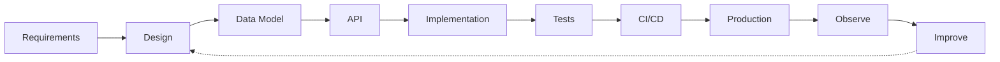
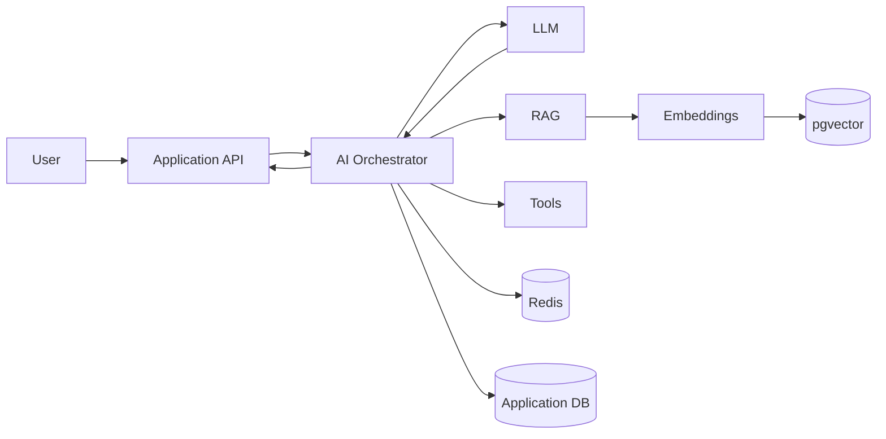

<div align="center">

# Fahad Ali Qureshi

### Senior Full Stack Engineer

Building scalable web applications, backend systems and AI-enabled products.

[](https://git.io/typing-svg)

<br/>

<a href="mailto:fahadaliqureshi786@gmail.com">

</a>
<a href="https://github.com/fahadaliqureshi">

</a>
<a href="https://discord.com/users/fahadaliqureshi">

</a>

</div>

---

## About

I'm a software engineer with **6+ years of experience** building production applications across frontend, backend and cloud infrastructure.

Most of my work is around **React, Next.js, TypeScript and Node.js**, but over the years I've worked across the complete application lifecycle: designing APIs, modelling databases, implementing authentication and permissions, building real-time systems, setting up deployments, debugging production issues and improving performance.

More recently, I've been building AI-enabled features using **LLMs, RAG, embeddings, semantic search and agentic workflows**.

I've worked with teams and clients across the US, Europe, Saudi Arabia and the Middle East.

```ts
const fahad = {
  role: "Senior Full Stack Engineer",
  location: "Islamabad, Pakistan",

  workingWith: {
    frontend: ["React", "Next.js", "TypeScript"],
    backend: ["Node.js", "NestJS", "Express", "FastAPI"],
    data: ["PostgreSQL", "MongoDB", "MySQL", "Redis"],
    cloud: ["AWS", "Docker", "GitHub Actions"],
    ai: ["OpenAI", "Claude", "RAG", "Embeddings", "AI Agents"],
  },

  interestedIn: [
    "System Design",
    "Scalable Backend Architecture",
    "AI Engineering",
    "Developer Experience",
  ],
};
```

---

## Stack

#### Frontend

<p>
  
</p>

React · Next.js · TypeScript · JavaScript · Redux Toolkit · React Query · Tailwind CSS · Material UI

#### Backend

<p>
  
</p>

Node.js · NestJS · Express · FastAPI · REST · GraphQL · Apollo · WebSockets

#### Data

<p>
  
</p>

PostgreSQL · MongoDB · MySQL · Redis · Firebase · Prisma · Sequelize · Mongoose · TypeORM · pgvector

#### Infrastructure

<p>
  
</p>

AWS · Docker · GitHub Actions · CI/CD · Linux · Nginx · CloudWatch

#### AI

OpenAI · Claude · LLMs · RAG · Embeddings · Semantic Search · pgvector · Tool Calling · Structured Outputs · AI Agents

---

## What I've been working on

A lot of my recent work sits somewhere between traditional full-stack engineering and applied AI.

That includes:

* LLM-powered application features
* RAG pipelines and vector retrieval
* Semantic search using embeddings
* Structured LLM outputs and tool calling
* AI moderation and summarization
* Agentic workflows
* API rate limiting and caching
* Real-time applications with WebSockets
* Authentication and RBAC
* REST and GraphQL API architecture
* Database and query optimization
* AWS deployments and CI/CD

I try to keep AI infrastructure modular instead of spreading model-specific logic throughout an application.

---

## Selected work

### AI-Powered Social Platform

A full-stack social networking application I've used to explore how AI features fit into a real product rather than building another isolated chatbot.

It includes traditional social features such as posts, comments, likes and profiles alongside:

`AI generation` · `comment suggestions` · `semantic search` · `moderation` · `RAG` · `embeddings` · `personalized feeds`

The backend architecture combines transactional storage, vector retrieval and caching:

```text
                    ┌─────────────────┐
                    │  React / Next   │
                    └────────┬────────┘
                             │
                             ▼
                    ┌─────────────────┐
                    │   Backend API   │
                    └────────┬────────┘
                             │
              ┌──────────────┼──────────────┐
              │              │              │
              ▼              ▼              ▼
          MongoDB       PostgreSQL        Redis
                            │
                         pgvector
                            │
                            ▼
                    ┌─────────────────┐
                    │ AI Orchestration│
                    └────────┬────────┘
                             │
                    ┌────────┴────────┐
                    ▼                 ▼
                 OpenAI             Claude
```

---

### Yuna Homes

Worked on frontend modules for a US real estate platform using React and Next.js.

Built property listing experiences, filters, responsive layouts, reusable components and API-integrated user flows.

---

### Enterprise Services Platform

Worked on a service management and office automation system with role-based business workflows.

The platform included dashboards, user management, service requests, administrative interfaces and API-backed workflows.

---

### Web3 / NFT Marketplace Systems

Worked on Web3 frontend systems including **Expor** and **Sqwid**.

Built marketplace interfaces, NFT listing flows, wallet integrations, dashboards and transaction-oriented DApp interfaces.

---

## Engineering

Frameworks change. The engineering problems underneath them usually don't.

The areas I spend most of my time thinking about are:

```text
System Design           API Design
Database Design         Authentication / RBAC
Caching                 Background Processing
Real-time Systems       Performance
Testing                 CI/CD
Observability           Production Reliability
```

My usual development flow looks something like:



---

## AI Engineering

I'm particularly interested in the engineering around LLM applications, not just prompting a model.



Areas I've worked with:

`RAG` · `Embeddings` · `Vector Search` · `AI Agents` · `Tool Calling` · `Structured Outputs` · `Prompt Engineering` · `Moderation` · `Summarization`

---

## Certifications

I've completed **14 professional certificates/courses** across backend development, cloud architecture, Python and machine learning.

### Meta

* Meta Back-End Developer
* Introduction to Back-End Development
* Programming in Python
* Version Control
* Introduction to Databases for Back-End Development
* Django Web Framework
* APIs
* The Full Stack
* Back-End Developer Capstone
* Coding Interview Preparation

### Amazon Web Services

* AWS Cloud Technical Essentials
* Architecting Solutions on AWS

### DeepLearning.AI

* Introduction to TensorFlow for Artificial Intelligence, Machine Learning, and Deep Learning

> 14 certificates completed across Meta, AWS and DeepLearning.AI.

---

## GitHub

Instead of relying on multiple third-party stat cards, I prefer keeping this section lightweight.

<div align="center">


</div>

<details>
<summary><b>More GitHub stats</b></summary>

<br/>

<div align="center">


<br/><br/>


</div>

</details>

---

## A little more about me

```yaml
name: Fahad Ali Qureshi
based_in: Islamabad, Pakistan
experience: 6+ years

focus:
  - full-stack engineering
  - backend architecture
  - scalable SaaS
  - applied AI

currently_exploring:
  - production RAG systems
  - agentic architectures
  - distributed systems
  - AI observability
  - vector retrieval

when_not_coding:
  - probably still thinking about code
```

---

## Certifications & Education

**BS Software Engineering**
Air University, Islamabad

Final year project: **Camera-Based Dress Code Inspection System using Computer Vision**

---

<div align="center">

### Building software that is useful, maintainable and ready for production.

<br/>


<br/><br/>

<a href="mailto:fahadaliqureshi786@gmail.com">Email</a>
  •   <a href="https://github.com/fahadaliqureshi">GitHub</a>
  •   <a href="https://discord.com/users/fahadaliqureshi">Discord</a>

</div>
